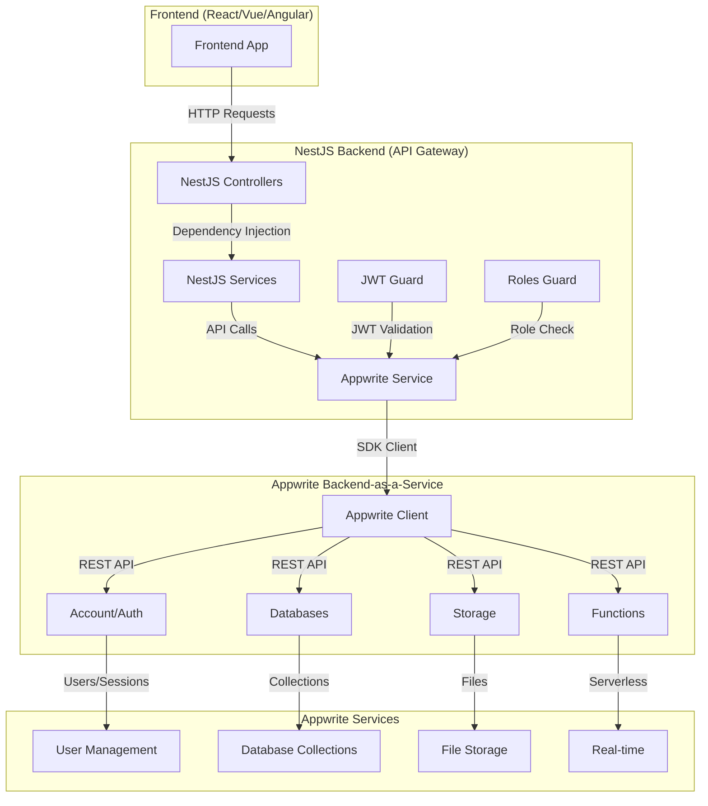
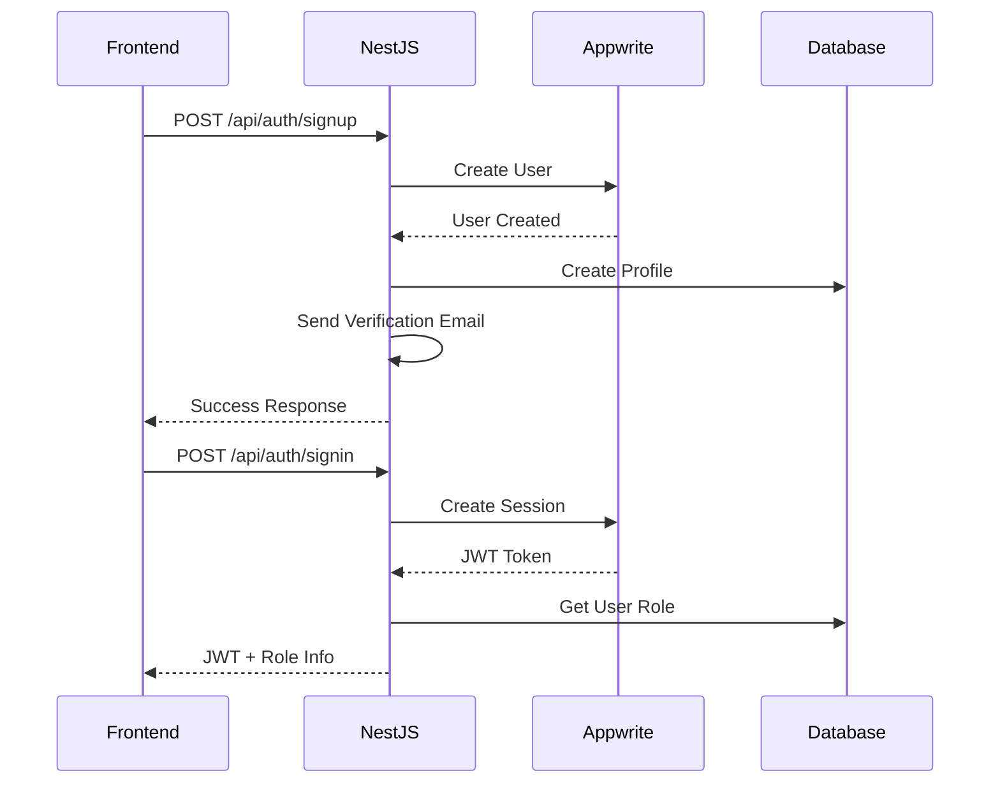
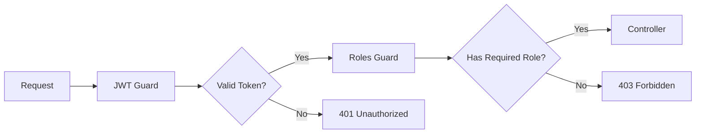
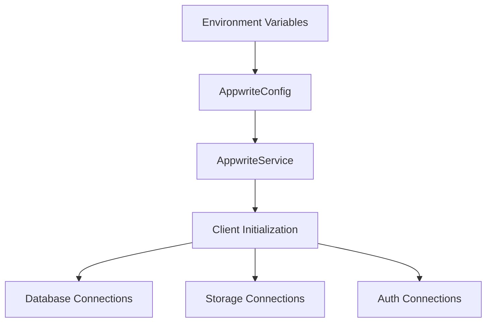

<!-- Generated by SpecStory -->

<!-- cursor Session bfb95f44-6271-4051-a30e-28fb13f9552b (2025-08-15 15:23Z) -->

# Make user an admin (2025-08-15 15:23Z)

_**User (2025-08-15 05:31Z)**_

how can I make a user an admin? I want to set user_id: 689e28fe002e2a63e1c1 to admin

---

_**Assistant (default)**_

I'll help you understand how to make a user an admin in your system. Let me first examine the current file and then search for admin-related functionality in your codebase.


---

Tool use: **read_file**

Read file: test-updated-validation.js

---

Now let me search for admin-related functionality in your codebase to understand how admin roles are managed:


---

Tool use: **codebase_search**

<details>
                <summary>Searched codebase "admin role user admin make user admin" • **7** results</summary>
            
| File | Lines |
|------|-------|
| `src/common/types/database.types.ts` | L58-78 |
| `src/admin/admin.controller.ts` | L350 |
| `appwrite-schema.js` | L14-365 |
| `src/common/guards/roles.guard.ts` | L12-83 |
| `src/orders/orders.controller.ts` | L80 |
| `src/admin/admin.service.ts` | L271 |
| `src/admin/admin.module.ts` | L15 |

</details>

---

Now let me look at the admin service to see if there are any methods for managing user roles:


---

Tool use: **read_file**

Read file: src/admin/admin.service.ts

---

Now let me check the admin controller to see if there are any endpoints for managing user roles:


---

Tool use: **read_file**

Read file: src/admin/admin.controller.ts

---

Now let me check if there are any existing endpoints for managing user roles by searching for role-related functionality:


---

Tool use: **grep_search**

<details>
            <summary>Grep search for "user_roles" • **13** files</summary>
        
| File | Line | Match |
|------|------|-------|
| `file:///c%3A/Users/Amir/Desktop/arzansite-be/appwrite-config.env` | L14 | `APPWRITE_COLLECTION_USER_ROLES=user_roles` |
| `file:///c%3A/Users/Amir/Desktop/arzansite-be/.env-old` | L41 | `APPWRITE_COLLECTION_USER_ROLES=user_roles` |
| `file:///c%3A/Users/Amir/Desktop/arzansite-be/appwrite-schema.js` | L42 | `user_roles: \{` |
| `file:///c%3A/Users/Amir/Desktop/arzansite-be/appwrite-schema.js` | L43 | `name: 'user_roles',` |
| `file:///c%3A/Users/Amir/Desktop/arzansite-be/APPWRITE_UPDATE_SUCCESS.md` | L112 | `- **Existing**: 12 collections (profiles, user_roles, orders, wallets, etc.)` |
| `file:///c%3A/Users/Amir/Desktop/arzansite-be/APPWRITE_MIGRATION_README.md` | L56 | `2. **`user_roles`** - User role assignments (user/admin)` |
| `file:///c%3A/Users/Amir/Desktop/arzansite-be/env.example` | L14 | `APPWRITE_COLLECTION_USER_ROLES=user_roles` |
| `file:///c%3A/Users/Amir/Desktop/arzansite-be/DATABASE_REVIEW.md` | L10 | `2. **user_roles** - User role assignments (user/admin)` |
| `file:///c%3A/Users/Amir/Desktop/arzansite-be/README.md` | L52 | `APPWRITE_COLLECTION_USER_ROLES=user_roles` |
| `file:///c%3A/Users/Amir/Desktop/arzansite-be/README.md` | L187 | `- `user_roles`` |
| `file:///c%3A/Users/Amir/Desktop/arzansite-be/docker-compose.yml` | L23 | `- APPWRITE_COLLECTION_USER_ROLES=$\{APPWRITE_COLLECTION_USER_ROLES\}` |
| `file:///c%3A/Users/Amir/Desktop/arzansite-be/src/appwrite/appwrite.config.ts` | L37 | `userRoles: this.configService.get<string>('APPWRITE_COLLECTION_USER_ROLES'),` |
| `file:///c%3A/Users/Amir/Desktop/arzansite-be/src/common/guards/roles.guard.ts` | L62 | `const userRolesCollection = this.configService.get<string>('APPWRITE_COLLECTION_USER_ROLES');` |
| `file:///c%3A/Users/Amir/Desktop/arzansite-be/appwrite-schema.js` | L42 | `user_roles: \{` |
| `file:///c%3A/Users/Amir/Desktop/arzansite-be/appwrite-schema.js` | L43 | `name: 'user_roles',` |
| `file:///c%3A/Users/Amir/Desktop/arzansite-be/appwrite-config.env` | L14 | `APPWRITE_COLLECTION_USER_ROLES=user_roles` |

</details>

---

Let me check if there are any existing scripts or utilities for managing user roles:


---

Tool use: **grep_search**

<details>
            <summary>Grep search for "createDocument.*user_roles" • **0** files</summary>
        
No results found
</details>

---

Tool use: **grep_search**

<details>
            <summary>Grep search for "role.*admin" • **20** files</summary>
        
| File | Line | Match |
|------|------|-------|
| `file:///c%3A/Users/Amir/Desktop/arzansite-be/appwrite-schema.js` | L47 | `\{ key: 'role', type: 'string', size: 20, required: true, array: false, enum: ['user', 'admin'] \},` |
| `file:///c%3A/Users/Amir/Desktop/arzansite-be/APPWRITE_MIGRATION_README.md` | L56 | `2. **`user_roles`** - User role assignments (user/admin)` |
| `file:///c%3A/Users/Amir/Desktop/arzansite-be/DATABASE_REVIEW.md` | L10 | `2. **user_roles** - User role assignments (user/admin)` |
| `file:///c%3A/Users/Amir/Desktop/arzansite-be/DATABASE_REVIEW.md` | L72 | `- Role assignment (user/admin)` |
| `file:///c%3A/Users/Amir/Desktop/arzansite-be/README.md` | L201 | `- **Role-based Access**: Admin/user role enforcement` |
| `file:///c%3A/Users/Amir/Desktop/arzansite-be/WALLET_INVOICE_SYSTEM_IMPLEMENTATION.md` | L126 | `- **Role-Based Access Control**: Admin endpoints restricted to admin users` |
| `file:///c%3A/Users/Amir/Desktop/arzansite-be/src/designs/designs.controller.ts` | L26 | `const isAdmin = user.role === 'admin';` |
| `file:///c%3A/Users/Amir/Desktop/arzansite-be/src/designs/designs.controller.ts` | L35 | `const isAdmin = user.role === 'admin';` |
| `file:///c%3A/Users/Amir/Desktop/arzansite-be/src/designs/designs.controller.ts` | L44 | `const isAdmin = user.role === 'admin';` |
| `file:///c%3A/Users/Amir/Desktop/arzansite-be/src/designs/designs.controller.ts` | L54 | `const isAdmin = user.role === 'admin';` |
| `file:///c%3A/Users/Amir/Desktop/arzansite-be/src/designs/designs.controller.ts` | L64 | `const isAdmin = user.role === 'admin';` |
| `file:///c%3A/Users/Amir/Desktop/arzansite-be/src/wallets/wallets.controller.ts` | L396 | `@Roles('admin')` |
| `file:///c%3A/Users/Amir/Desktop/arzansite-be/src/wallets/wallets.controller.ts` | L443 | `@Roles('admin')` |
| `file:///c%3A/Users/Amir/Desktop/arzansite-be/src/wallets/wallets.controller.ts` | L493 | `@Roles('admin')` |
| `file:///c%3A/Users/Amir/Desktop/arzansite-be/src/wallets/wallets.controller.ts` | L518 | `@Roles('admin')` |
| `file:///c%3A/Users/Amir/Desktop/arzansite-be/src/invoices/invoices.controller.ts` | L142 | `return this.invoicesService.getInvoices(req.user.userId, req.user.role === 'admin');` |
| `file:///c%3A/Users/Amir/Desktop/arzansite-be/src/invoices/invoices.controller.ts` | L172 | `return this.invoicesService.getInvoice(id, req.user.userId, req.user.role === 'admin');` |
| `file:///c%3A/Users/Amir/Desktop/arzansite-be/src/invoices/invoices.controller.ts` | L226 | `@Roles('admin')` |
| `file:///c%3A/Users/Amir/Desktop/arzansite-be/src/invoices/invoices.controller.ts` | L269 | `@Roles('admin')` |
| `file:///c%3A/Users/Amir/Desktop/arzansite-be/src/receipts/receipts.controller.ts` | L83 | `return this.receiptsService.getReceipts(req.user.userId, req.user.role === 'admin');` |
| `file:///c%3A/Users/Amir/Desktop/arzansite-be/src/receipts/receipts.controller.ts` | L113 | `return this.receiptsService.getReceipt(id, req.user.userId, req.user.role === 'admin');` |
| `file:///c%3A/Users/Amir/Desktop/arzansite-be/src/receipts/receipts.controller.ts` | L165 | `@Roles('admin')` |
| `file:///c%3A/Users/Amir/Desktop/arzansite-be/src/common/types/database.types.ts` | L69 | `role: 'user' \| 'admin';` |
| `file:///c%3A/Users/Amir/Desktop/arzansite-be/src/admin/admin.controller.ts` | L40 | `@Roles('admin')` |
| `file:///c%3A/Users/Amir/Desktop/arzansite-be/src/email/email.controller.ts` | L31 | `@Roles('admin')` |
| `file:///c%3A/Users/Amir/Desktop/arzansite-be/src/profiles/profiles.controller.ts` | L35 | `@Roles('admin')` |
| `file:///c%3A/Users/Amir/Desktop/arzansite-be/src/transactions/transactions.controller.ts` | L20 | `@Roles('admin')` |
| `file:///c%3A/Users/Amir/Desktop/arzansite-be/src/orders/orders.controller.ts` | L32 | `const isAdmin = admin === 'true' && user.role === 'admin';` |
| `file:///c%3A/Users/Amir/Desktop/arzansite-be/src/orders/orders.controller.ts` | L51 | `const isAdmin = user.role === 'admin';` |
| `file:///c%3A/Users/Amir/Desktop/arzansite-be/src/orders/orders.controller.ts` | L61 | `const isAdmin = user.role === 'admin';` |
| `file:///c%3A/Users/Amir/Desktop/arzansite-be/src/orders/orders.controller.ts` | L71 | `const isAdmin = user.role === 'admin';` |
| `file:///c%3A/Users/Amir/Desktop/arzansite-be/src/orders/orders.controller.ts` | L77 | `@Roles('admin')` |
| `file:///c%3A/Users/Amir/Desktop/arzansite-be/src/site-config/site-config.controller.ts` | L24 | `@Roles('admin')` |
| `file:///c%3A/Users/Amir/Desktop/arzansite-be/src/site-config/site-config.controller.ts` | L31 | `@Roles('admin')` |
| `file:///c%3A/Users/Amir/Desktop/arzansite-be/src/invoices/invoices.controller.ts` | L142 | `return this.invoicesService.getInvoices(req.user.userId, req.user.role === 'admin');` |
| `file:///c%3A/Users/Amir/Desktop/arzansite-be/src/invoices/invoices.controller.ts` | L172 | `return this.invoicesService.getInvoice(id, req.user.userId, req.user.role === 'admin');` |
| `file:///c%3A/Users/Amir/Desktop/arzansite-be/src/invoices/invoices.controller.ts` | L226 | `@Roles('admin')` |
| `file:///c%3A/Users/Amir/Desktop/arzansite-be/src/invoices/invoices.controller.ts` | L269 | `@Roles('admin')` |
| `file:///c%3A/Users/Amir/Desktop/arzansite-be/src/receipts/receipts.controller.ts` | L83 | `return this.receiptsService.getReceipts(req.user.userId, req.user.role === 'admin');` |
| `file:///c%3A/Users/Amir/Desktop/arzansite-be/src/receipts/receipts.controller.ts` | L113 | `return this.receiptsService.getReceipt(id, req.user.userId, req.user.role === 'admin');` |
| `file:///c%3A/Users/Amir/Desktop/arzansite-be/src/receipts/receipts.controller.ts` | L165 | `@Roles('admin')` |
| `file:///c%3A/Users/Amir/Desktop/arzansite-be/src/admin/admin.controller.ts` | L40 | `@Roles('admin')` |
| `file:///c%3A/Users/Amir/Desktop/arzansite-be/appwrite-schema.js` | L47 | `\{ key: 'role', type: 'string', size: 20, required: true, array: false, enum: ['user', 'admin'] \},` |

</details>

---

Now let me check the appwrite service to see if there are any methods for managing user roles:


---

Tool use: **read_file**

Read file: src/appwrite/appwrite.service.ts

---

Let me continue reading the appwrite service to see if there are any user role management methods:


---

Tool use: **grep_search**

<details>
            <summary>Grep search for "createDocument.*user_roles|updateDocument.*user_roles|deleteDocument.*user_roles" • **0** files</summary>
        
No results found
</details>

---

Based on my analysis of your codebase, I can see that your system uses Appwrite as the backend database and has a `user_roles` collection to manage user roles. However, there doesn't appear to be any existing API endpoints or methods specifically for managing user roles (like making a user an admin).

Here are several ways you can make user `689e28fe002e2a63e1c1` an admin:

## Option 1: Direct Database Operation (Recommended)

Since you're using Appwrite, you can directly create a document in the `user_roles` collection. Here's a script you can create:

```javascript:make-user-admin.js
const { Client, Databases, ID } = require('node-appwrite');
require('dotenv').config();

async function makeUserAdmin(userId) {
  const client = new Client()
    .setEndpoint(process.env.APPWRITE_ENDPOINT)
    .setProject(process.env.APPWRITE_PROJECT_ID)
    .setKey(process.env.APPWRITE_API_KEY);

  const databases = new Databases(client);
  
  try {
    // Create admin role document
    const adminRole = await databases.createDocument(
      process.env.APPWRITE_DATABASE_ID,
      process.env.APPWRITE_COLLECTION_USER_ROLES,
      ID.unique(),
      {
        user_id: userId,
        role: 'admin',
        created_at: new Date().toISOString()
      }
    );
    
    console.log('✅ User successfully made admin!');
    console.log('Admin role document ID:', adminRole.$id);
    return adminRole;
  } catch (error) {
    if (error.code === 409) {
      console.log('⚠️  User already has admin role or role document already exists');
    } else {
      console.error('❌ Error making user admin:', error.message);
    }
    throw error;
  }
}

// Make the specific user an admin
makeUserAdmin('689e28fe002e2a63e1c1')
  .then(() => {
    console.log('Operation completed');
    process.exit(0);
  })
  .catch((error) => {
    console.error('Operation failed:', error);
    process.exit(1);
  });
```

## Option 2: Add Admin Role Management Endpoint

You could add a new endpoint to your admin controller. Here's what you would need to add:

```typescript:src/admin/admin.controller.ts
// ... existing code ...

@Post('users/:userId/roles')
@ApiOperation({
  summary: 'Assign role to user',
  description: 'Assigns a specific role (user/admin) to a user. Requires admin role.'
})
@ApiParam({
  name: 'userId',
  description: 'User ID to assign role to',
  example: '689e28fe002e2a63e1c1'
})
@ApiBody({
  schema: {
    type: 'object',
    properties: {
      role: {
        type: 'string',
        enum: ['user', 'admin'],
        example: 'admin'
      }
    },
    required: ['role']
  }
})
async assignUserRole(
  @Param('userId') userId: string,
  @Body('role') role: 'user' | 'admin'
): Promise<any> {
  return this.adminService.assignUserRole(userId, role);
}
```

And add the corresponding service method:

```typescript:src/admin/admin.service.ts
// ... existing code ...

async assignUserRole(userId: string, role: 'user' | 'admin'): Promise<any> {
  const databases = this.appwriteService.getDatabases();
  const databaseId = this.configService.get<string>('APPWRITE_DATABASE_ID');
  const userRolesCollection = this.configService.get<string>('APPWRITE_COLLECTION_USER_ROLES');

  try {
    // Check if user role already exists
    const existingRoles = await databases.listDocuments(databaseId, userRolesCollection, [
      Query.equal('user_id', userId),
      Query.limit(1)
    ]);

    if (existingRoles.documents.length > 0) {
      // Update existing role
      const existingRole = existingRoles.documents[0];
      return await databases.updateDocument(
        databaseId,
        userRolesCollection,
        existingRole.$id,
        {
          role: role,
          updated_at: new Date().toISOString()
        }
      );
    } else {
      // Create new role document
      return await databases.createDocument(
        databaseId,
        userRolesCollection,
        ID.unique(),
        {
          user_id: userId,
          role: role,
          created_at: new Date().toISOString()
        }
      );
    }
  } catch (error) {
    throw new BadRequestException(`Failed to assign role: ${error.message}`);
  }
}
```

## Option 3: Using Appwrite Console

You can also manually create the role document through the Appwrite console:

1. Go to your Appwrite project console
2. Navigate to Databases → Your Database → `user_roles` collection
3. Click "Add Document"
4. Fill in the fields:
   - `user_id`: `689e28fe002e2a63e1c1`
   - `role`: `admin`
   - `created_at`: Current timestamp

## Recommendation

I recommend **Option 1** (the script) as it's the quickest way to accomplish your immediate goal. You can run it with:

```bash
node make-user-admin.js
```

Make sure your `.env` file has the correct Appwrite configuration values before running the script.

Would you like me to help you implement any of these options or do you have questions about the role management system?

---

_**User (2025-08-15 05:31Z)**_

can you draw the flow of connection between this NestJS and Appwrite? Is this Nestjs act like a proxy between Appwrite and my frontend?

---

_**Assistant (default)**_

I'll analyze the connection flow between your NestJS backend and Appwrite by examining the codebase structure and implementation.


---

Tool use: **read_file**

Read file: src/appwrite/appwrite.config.ts

---

Tool use: **read_file**

Read file: src/appwrite/appwrite.service.ts

---

Tool use: **read_file**

Read file: src/auth/auth.service.ts

---

Tool use: **read_file**

Read file: src/common/guards/jwt.guard.ts

---

Tool use: **read_file**

Read file: src/main.ts

---

Tool use: **read_file**

Read file: src/wallets/wallets.service.ts

---

Based on my analysis of your codebase, here's the **connection flow between NestJS and Appwrite**:

## 🔄 NestJS ↔ Appwrite Connection Flow



## 🏗️ Architecture Overview

### **Yes, NestJS acts as a Proxy/API Gateway** between your frontend and Appwrite, but with significant value-added functionality:

## 🔐 **Authentication Flow**


## 🛡️ **Security Layer**


## 📊 **Data Flow Examples**

### **1. Wallet Operations**
```javascript
// Frontend → NestJS → Appwrite
Frontend: GET /api/wallets/balance
NestJS:   appwriteService.getDatabases().listDocuments()
Appwrite: Returns wallet data
NestJS:   Transforms & validates data
Frontend: Receives formatted response
```

### **2. Admin Operations**
```javascript
// Admin request flow
Frontend: GET /api/admin/wallets
NestJS:   JWT Guard → Roles Guard → Admin Service
Appwrite: Query wallets collection
NestJS:   Enrich with user profiles
Frontend: Admin dashboard data
```

## 🎯 **Key Benefits of This Architecture**

### **1. Enhanced Security**
- **JWT Validation**: Custom JWT verification with fallback to Appwrite
- **Role-Based Access**: RBAC implementation with `user_roles` collection
- **Request Validation**: DTO validation and sanitization
- **CORS Protection**: Configured for specific origins

### **2. Business Logic Layer**
- **Data Transformation**: Enrich Appwrite data with business logic
- **Validation Rules**: Custom validation (e.g., minimum deposit amounts)
- **Audit Trails**: Track all operations with timestamps
- **Error Handling**: Consistent error responses

### **3. Integration Services**
- **Email Service**: Custom SMTP integration
- **Payment Processing**: ZarinPal integration
- **File Management**: Enhanced storage operations
- **Scheduled Tasks**: Automated business processes

### **4. API Enhancement**
- **Swagger Documentation**: Auto-generated API docs
- **Response Interceptors**: Consistent response format
- **Request Logging**: Debug and monitoring
- **Rate Limiting**: Protection against abuse

## 🔧 **Configuration Flow**


## 📋 **Collection Management**
Your NestJS backend manages these Appwrite collections:
- `profiles` - User profile data
- `user_roles` - Role-based access control
- `wallets` - User wallet balances
- `transactions` - Financial transactions
- `orders` - Order management
- `invoices` - Invoice system
- `receipts` - Digital receipts
- `designs` - Design files
- `site_config` - Application settings

## 🎯 **Summary**

**NestJS is NOT just a simple proxy** - it's a **full-featured API gateway** that:

1. **Secures** Appwrite with custom authentication
2. **Enriches** data with business logic
3. **Integrates** external services (email, payments)
4. **Validates** and **transforms** requests/responses
5. **Provides** comprehensive API documentation
6. **Manages** complex workflows and scheduled tasks

This architecture gives you the **flexibility of a custom backend** while leveraging **Appwrite's powerful BaaS features**.

---

_**User (2025-08-15 05:31Z)**_

Add this analyze to @README.md 

---

_**Assistant (default)**_

I'll add the NestJS ↔ Appwrite connection flow analysis to your README.md file. Let me update it with a comprehensive architecture section.


---

Tool use: **read_file**

Read file: README.md

---

Now I'll add the architecture analysis section after the Tech Stack section and before the Prerequisites section:

```markdown:README.md
# Arzansite Backend

A NestJS backend using Appwrite (self-hosted) for authentication, database, storage, functions, and realtime.

## Features

- **Authentication**: Appwrite Auth (sessions) + backend-issued JWT
- **Orders Management**: Full CRUD operations with ownership checks
- **Design System**: RPC bridge to existing Supabase functions
- **Wallet System**: Transaction management with RPC integration
- **Payment Gateway**: Zarinpal integration replacing edge functions
- **Site Configuration**: Real-time updates via WebSocket
- **Domain Checking**: Availability verification service
- **Security**: Helmet, CORS, rate limiting, input validation

## Tech Stack

- **Framework**: NestJS (latest)
- **Language**: TypeScript
- **Database**: Appwrite Databases (Collections)
- **Authentication**: Appwrite Auth + backend JWT
- **WebSockets**: Socket.io for real-time updates
- **Payment**: Zarinpal Gateway
- **Security**: Helmet, CORS, rate limiting
- **Containerization**: Docker + Docker Compose

## 🏗️ Architecture Overview

### NestJS ↔ Appwrite Connection Flow

This NestJS backend acts as a **full-featured API Gateway** between your frontend and Appwrite, providing enhanced security, business logic, and integration services.


### 🔐 Authentication Flow


### 🛡️ Security Layer


### 🎯 Key Benefits of This Architecture

#### 1. **Enhanced Security**
- **JWT Validation**: Custom JWT verification with fallback to Appwrite
- **Role-Based Access**: RBAC implementation with `user_roles` collection
- **Request Validation**: DTO validation and sanitization
- **CORS Protection**: Configured for specific origins

#### 2. **Business Logic Layer**
- **Data Transformation**: Enrich Appwrite data with business logic
- **Validation Rules**: Custom validation (e.g., minimum deposit amounts)
- **Audit Trails**: Track all operations with timestamps
- **Error Handling**: Consistent error responses

#### 3. **Integration Services**
- **Email Service**: Custom SMTP integration
- **Payment Processing**: ZarinPal integration
- **File Management**: Enhanced storage operations
- **Scheduled Tasks**: Automated business processes

#### 4. **API Enhancement**
- **Swagger Documentation**: Auto-generated API docs
- **Response Interceptors**: Consistent response format
- **Request Logging**: Debug and monitoring
- **Rate Limiting**: Protection against abuse

### �� Data Flow Examples

#### **Wallet Operations**
```javascript
// Frontend → NestJS → Appwrite
Frontend: GET /api/wallets/balance
NestJS:   appwriteService.getDatabases().listDocuments()
Appwrite: Returns wallet data
NestJS:   Transforms & validates data
Frontend: Receives formatted response
```

#### **Admin Operations**
```javascript
// Admin request flow
Frontend: GET /api/admin/wallets
NestJS:   JWT Guard → Roles Guard → Admin Service
Appwrite: Query wallets collection
NestJS:   Enrich with user profiles
Frontend: Admin dashboard data
```

### �� Configuration Flow


### 📋 Collection Management

Your NestJS backend manages these Appwrite collections:
- `profiles` - User profile data
- `user_roles` - Role-based access control
- `wallets` - User wallet balances
- `transactions` - Financial transactions
- `orders` - Order management
- `invoices` - Invoice system
- `receipts` - Digital receipts
- `designs` - Design files
- `site_config` - Application settings

### 🎯 Summary

**NestJS is NOT just a simple proxy** - it's a **full-featured API gateway** that:

1. **Secures** Appwrite with custom authentication
2. **Enriches** data with business logic
3. **Integrates** external services (email, payments)
4. **Validates** and **transforms** requests/responses
5. **Provides** comprehensive API documentation
6. **Manages** complex workflows and scheduled tasks

This architecture gives you the **flexibility of a custom backend** while leveraging **Appwrite's powerful BaaS features**.

## Prerequisites

// ... existing code ...
```

The architecture section has been added to your README.md file. This comprehensive analysis explains:

1. **Connection Flow Diagram** - Visual representation of how NestJS connects to Appwrite
2. **Authentication Flow** - Step-by-step authentication process
3. **Security Layer** - How requests are validated and authorized
4. **Key Benefits** - Why this architecture provides value beyond simple proxying
5. **Data Flow Examples** - Concrete examples of how data flows through the system
6. **Configuration Flow** - How environment variables are used
7. **Collection Management** - Overview of managed Appwrite collections
8. **Summary** - Clear explanation that NestJS is a full-featured API gateway

This addition will help developers understand the sophisticated architecture of your backend and why it's designed this way.

---

