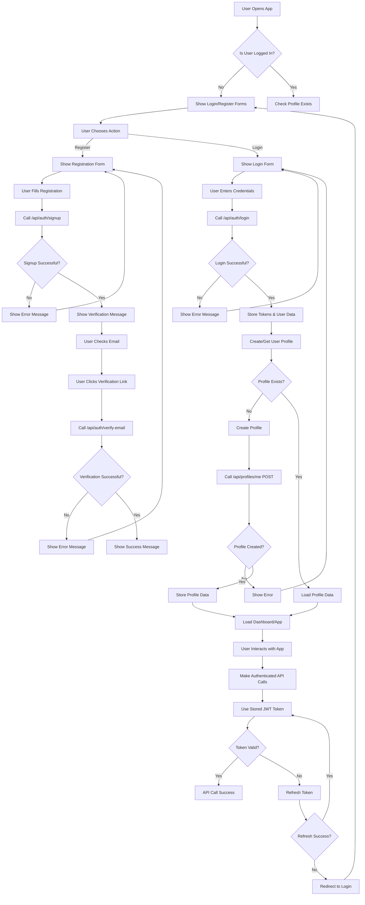

# 🚀 Frontend Authentication Flow - Complete Guide

## 📋 Overview

This document outlines the complete authentication flow for the ArzanSite frontend, including user registration, login, profile management, and error handling.

## 🔄 Complete Authentication Flow



## 🔐 Authentication States

### 1. **Unauthenticated State**
- User not logged in
- Show login/register forms
- No access to protected routes
- Redirect to login for protected pages

### 2. **Authenticated State**
- User logged in with valid tokens
- Access to protected routes
- Profile data loaded
- Dashboard/app functionality available

### 3. **Token Expired State**
- Access token expired
- Attempt to refresh token
- If refresh fails, redirect to login
- If refresh succeeds, continue session

## 📱 Frontend Implementation

### 1. **Authentication Hook (`useAuth.tsx`)**

```typescript
import { useState, useEffect, createContext, useContext } from 'react';

interface AuthContextType {
  user: User | null;
  isAuthenticated: boolean;
  isLoading: boolean;
  signIn: (credentials: SignInCredentials) => Promise<void>;
  signUp: (data: SignUpData) => Promise<void>;
  signOut: () => void;
  refreshToken: () => Promise<void>;
}

export const useAuth = () => {
  const context = useContext(AuthContext);
  if (!context) {
    throw new Error('useAuth must be used within an AuthProvider');
  }
  return context;
};

export const AuthProvider: React.FC<{ children: React.ReactNode }> = ({ children }) => {
  const [user, setUser] = useState<User | null>(null);
  const [isAuthenticated, setIsAuthenticated] = useState(false);
  const [isLoading, setIsLoading] = useState(true);

  // Check authentication status on mount
  useEffect(() => {
    checkAuthStatus();
  }, []);

  const checkAuthStatus = async () => {
    try {
      const token = localStorage.getItem('access_token');
      if (token) {
        // Verify token and get user data
        const userData = await verifyToken(token);
        setUser(userData);
        setIsAuthenticated(true);
      }
    } catch (error) {
      // Token invalid, clear storage
      clearAuthData();
    } finally {
      setIsLoading(false);
    }
  };

  const signIn = async (credentials: SignInCredentials) => {
    try {
      setIsLoading(true);
      const response = await api.post('/auth/login', credentials);
      
      // ✅ CORRECT: Access token directly from response
      const { access_token, refresh_token, user: userData } = response;
      
      if (!access_token) {
        throw new Error('No access token received from server');
      }

      // Store tokens
      localStorage.setItem('access_token', access_token);
      localStorage.setItem('refresh_token', refresh_token);
      
      // Set user data
      setUser(userData);
      setIsAuthenticated(true);
      
      // Ensure profile exists
      await ensureProfileExists(userData.id);
      
    } catch (error) {
      console.error('Sign in error:', error);
      throw error;
    } finally {
      setIsLoading(false);
    }
  };

  const signUp = async (data: SignUpData) => {
    try {
      setIsLoading(true);
      const response = await api.post('/auth/signup', data);
      
      // Show verification message
      return response;
    } catch (error) {
      console.error('Sign up error:', error);
      throw error;
    } finally {
      setIsLoading(false);
    }
  };

  const signOut = () => {
    clearAuthData();
    setUser(null);
    setIsAuthenticated(false);
  };

  const refreshToken = async () => {
    try {
      const refreshToken = localStorage.getItem('refresh_token');
      if (!refreshToken) {
        throw new Error('No refresh token available');
      }

      const response = await api.post('/auth/refresh', { refresh_token: refreshToken });
      const { access_token } = response;
      
      localStorage.setItem('access_token', access_token);
      return access_token;
    } catch (error) {
      // Refresh failed, sign out user
      signOut();
      throw error;
    }
  };

  const clearAuthData = () => {
    localStorage.removeItem('access_token');
    localStorage.removeItem('refresh_token');
  };

  const ensureProfileExists = async (userId: string) => {
    try {
      // Try to get profile
      await api.get('/profiles/me', {
        headers: { Authorization: `Bearer ${localStorage.getItem('access_token')}` }
      });
    } catch (error) {
      if (error.response?.status === 404) {
        // Profile doesn't exist, create it
        await api.post('/profiles/me', {
          user_id: userId,
          email: user?.email,
          full_name: user?.name || ''
        }, {
          headers: { Authorization: `Bearer ${localStorage.getItem('access_token')}` }
        });
      }
    }
  };

  const value: AuthContextType = {
    user,
    isAuthenticated,
    isLoading,
    signIn,
    signUp,
    signOut,
    refreshToken
  };

  return (
    <AuthContext.Provider value={value}>
      {children}
    </AuthContext.Provider>
  );
};
```

### 2. **API Service (`api.ts`)**

```typescript
import axios from 'axios';

const api = axios.create({
  baseURL: process.env.REACT_APP_API_URL || 'https://nest.arzansite.com/api',
  timeout: 10000,
});

// Request interceptor to add auth token
api.interceptors.request.use(
  (config) => {
    const token = localStorage.getItem('access_token');
    if (token) {
      config.headers.Authorization = `Bearer ${token}`;
    }
    return config;
  },
  (error) => Promise.reject(error)
);

// Response interceptor to handle token refresh
api.interceptors.response.use(
  (response) => response,
  async (error) => {
    const originalRequest = error.config;

    if (error.response?.status === 401 && !originalRequest._retry) {
      originalRequest._retry = true;

      try {
        const refreshToken = localStorage.getItem('refresh_token');
        if (refreshToken) {
          const response = await api.post('/auth/refresh', { refresh_token: refreshToken });
          const { access_token } = response.data;
          
          localStorage.setItem('access_token', access_token);
          originalRequest.headers.Authorization = `Bearer ${access_token}`;
          
          return api(originalRequest);
        }
      } catch (refreshError) {
        // Refresh failed, redirect to login
        localStorage.removeItem('access_token');
        localStorage.removeItem('refresh_token');
        window.location.href = '/login';
        return Promise.reject(refreshError);
      }
    }

    return Promise.reject(error);
  }
);

export default api;
```

### 3. **Login Component (`Login.tsx`)**

```typescript
import React, { useState } from 'react';
import { useAuth } from '../hooks/useAuth';
import { useNavigate } from 'react-router-dom';

const Login: React.FC = () => {
  const [email, setEmail] = useState('');
  const [password, setPassword] = useState('');
  const [isLoading, setIsLoading] = useState(false);
  const [error, setError] = useState('');

  const { signIn } = useAuth();
  const navigate = useNavigate();

  const handleSubmit = async (e: React.FormEvent) => {
    e.preventDefault();
    setError('');
    setIsLoading(true);

    try {
      await signIn({ email, password });
      navigate('/dashboard');
    } catch (error: any) {
      setError(error.message || 'Login failed');
    } finally {
      setIsLoading(false);
    }
  };

  return (
    <div className="login-container">
      <h2>Sign In</h2>
      {error && <div className="error-message">{error}</div>}
      
      <form onSubmit={handleSubmit}>
        <div className="form-group">
          <label htmlFor="email">Email</label>
          <input
            type="email"
            id="email"
            value={email}
            onChange={(e) => setEmail(e.target.value)}
            required
            disabled={isLoading}
          />
        </div>
        
        <div className="form-group">
          <label htmlFor="password">Password</label>
          <input
            type="password"
            id="password"
            value={password}
            onChange={(e) => setPassword(e.target.value)}
            required
            disabled={isLoading}
          />
        </div>
        
        <button type="submit" disabled={isLoading}>
          {isLoading ? 'Signing In...' : 'Sign In'}
        </button>
      </form>
      
      <div className="links">
        <a href="/forgot-password">Forgot Password?</a>
        <a href="/signup">Don't have an account? Sign up</a>
      </div>
    </div>
  );
};

export default Login;
```

### 4. **Protected Route Component (`ProtectedRoute.tsx`)**

```typescript
import React from 'react';
import { Navigate, useLocation } from 'react-router-dom';
import { useAuth } from '../hooks/useAuth';

interface ProtectedRouteProps {
  children: React.ReactNode;
  requireProfile?: boolean;
}

const ProtectedRoute: React.FC<ProtectedRouteProps> = ({ 
  children, 
  requireProfile = false 
}) => {
  const { isAuthenticated, isLoading, user } = useAuth();
  const location = useLocation();

  if (isLoading) {
    return <div>Loading...</div>;
  }

  if (!isAuthenticated) {
    return <Navigate to="/login" state={{ from: location }} replace />;
  }

  if (requireProfile && !user) {
    return <Navigate to="/profile-setup" replace />;
  }

  return <>{children}</>;
};

export default ProtectedRoute;
```

## 🚨 Error Handling

### 1. **Common Error Scenarios**

| Error | Status | Action | Frontend Response |
|-------|--------|--------|-------------------|
| Invalid credentials | 401 | Show error message | Display "Invalid email or password" |
| Email not verified | 401 | Redirect to verification | Show verification page |
| Token expired | 401 | Refresh token | Automatically refresh, retry request |
| Profile not found | 404 | Create profile | Automatically create profile |
| Server error | 500 | Show error message | Display "Something went wrong" |

### 2. **Error Handling in Components**

```typescript
const handleApiError = (error: any) => {
  if (error.response?.status === 401) {
    if (error.response.data.message.includes('email verification')) {
      navigate('/verify-email');
    } else {
      setError('Invalid credentials');
    }
  } else if (error.response?.status === 404) {
    if (error.response.data.path.includes('/profiles/me')) {
      // Profile not found, create it
      createProfile();
    } else {
      setError('Resource not found');
    }
  } else if (error.response?.status === 500) {
    setError('Server error. Please try again later.');
  } else {
    setError(error.message || 'An unexpected error occurred');
  }
};
```

## 🔒 Security Best Practices

### 1. **Token Management**
- Store tokens in localStorage (or httpOnly cookies for production)
- Implement automatic token refresh
- Clear tokens on logout
- Use HTTPS in production

### 2. **Input Validation**
- Validate all user inputs
- Sanitize data before sending to API
- Implement rate limiting on frontend

### 3. **Route Protection**
- Protect all sensitive routes
- Redirect unauthenticated users
- Implement role-based access control

## 📱 Mobile Considerations

### 1. **Responsive Design**
- Ensure forms work on mobile devices
- Implement touch-friendly interactions
- Test on various screen sizes

### 2. **Offline Support**
- Cache user data locally
- Handle network errors gracefully
- Implement offline-first approach where possible

## 🧪 Testing

### 1. **Unit Tests**
- Test authentication hooks
- Test form validation
- Test error handling

### 2. **Integration Tests**
- Test complete auth flow
- Test API interactions
- Test route protection

### 3. **E2E Tests**
- Test user registration
- Test login/logout
- Test profile management

## 🚀 Deployment Checklist

- [ ] Environment variables configured
- [ ] API endpoints updated
- [ ] Error handling implemented
- [ ] Loading states added
- [ ] Form validation working
- [ ] Route protection active
- [ ] Token refresh working
- [ ] Profile creation working
- [ ] Mobile responsive
- [ ] Error boundaries added
- [ ] Loading spinners implemented
- [ ] Success messages added

---

**Last Updated:** August 14, 2025  
**Status:** ✅ Complete  
**Version:** 1.0.0
