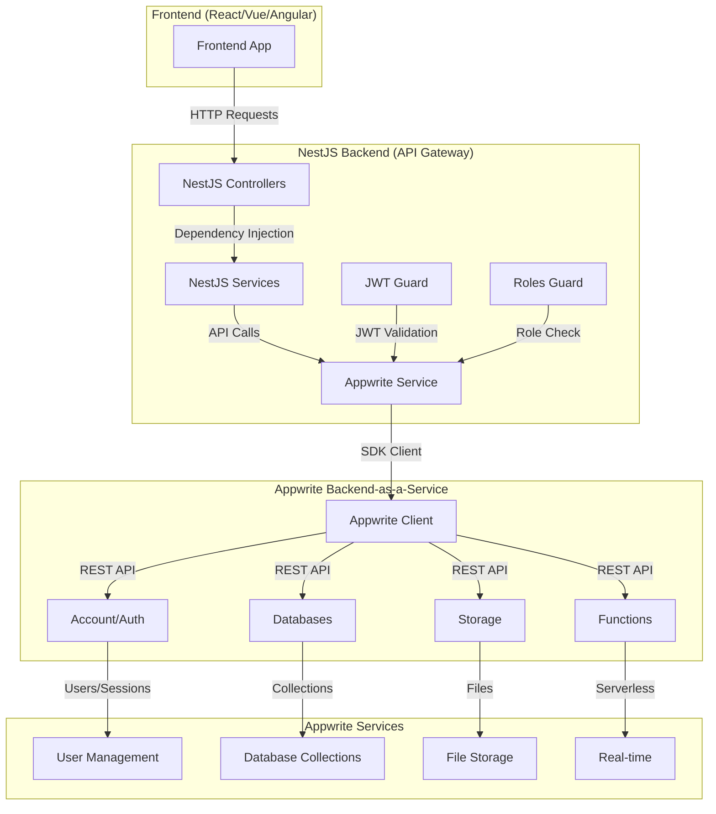
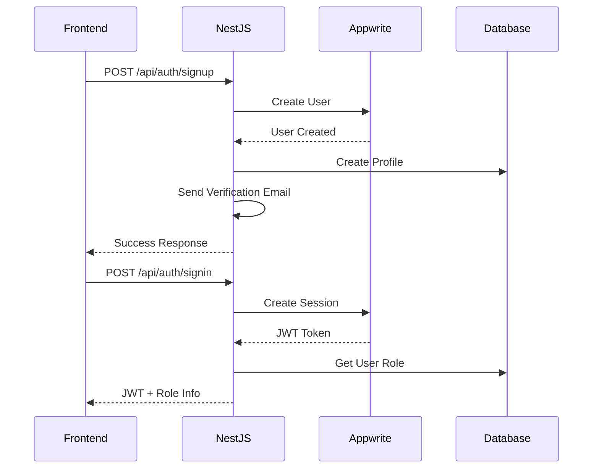
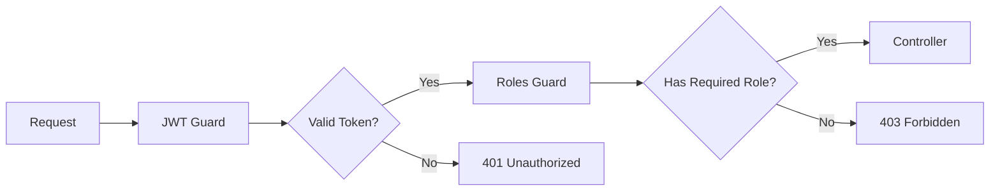
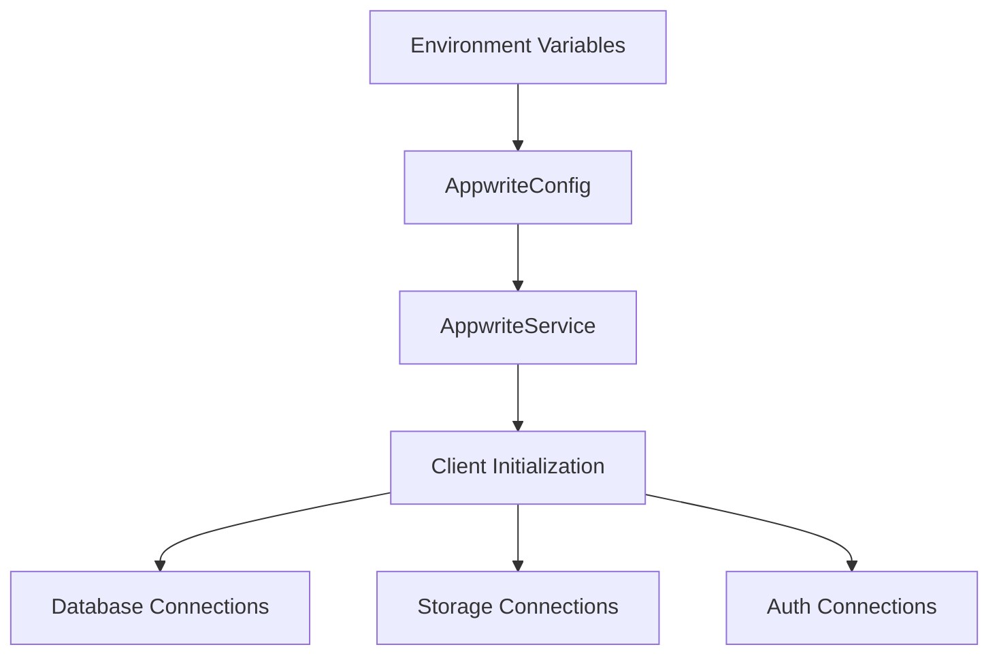

# Arzansite Backend

A NestJS backend using Appwrite (self-hosted) for authentication, database, storage, functions, and realtime.

## Features

- **Authentication**: Appwrite Auth (sessions) + backend-issued JWT
- **Orders Management**: Full CRUD operations with ownership checks
- **Design System**: RPC bridge to existing Supabase functions
- **Wallet System**: Transaction management with RPC integration
- **Payment Gateway**: Zarinpal integration replacing edge functions
- **Site Configuration**: Real-time updates via WebSocket
- **Domain Checking**: Availability verification service
- **Security**: Helmet, CORS, rate limiting, input validation

## Tech Stack

- **Framework**: NestJS (latest)
- **Language**: TypeScript
- **Database**: Appwrite Databases (Collections)
- **Authentication**: Appwrite Auth + backend JWT
- **WebSockets**: Socket.io for real-time updates
- **Payment**: Zarinpal Gateway
- **Security**: Helmet, CORS, rate limiting
- **Containerization**: Docker + Docker Compose

## 🏗️ Architecture Overview

### NestJS ↔ Appwrite Connection Flow

This NestJS backend acts as a **full-featured API Gateway** between your frontend and Appwrite, providing enhanced security, business logic, and integration services.



### 🔐 Authentication Flow



### 🛡️ Security Layer



### 🎯 Key Benefits of This Architecture

#### 1. **Enhanced Security**
- **JWT Validation**: Custom JWT verification with fallback to Appwrite
- **Role-Based Access**: RBAC implementation with `user_roles` collection
- **Request Validation**: DTO validation and sanitization
- **CORS Protection**: Configured for specific origins

#### 2. **Business Logic Layer**
- **Data Transformation**: Enrich Appwrite data with business logic
- **Validation Rules**: Custom validation (e.g., minimum deposit amounts)
- **Audit Trails**: Track all operations with timestamps
- **Error Handling**: Consistent error responses

#### 3. **Integration Services**
- **Email Service**: Custom SMTP integration
- **Payment Processing**: ZarinPal integration
- **File Management**: Enhanced storage operations
- **Scheduled Tasks**: Automated business processes

#### 4. **API Enhancement**
- **Swagger Documentation**: Auto-generated API docs
- **Response Interceptors**: Consistent response format
- **Request Logging**: Debug and monitoring
- **Rate Limiting**: Protection against abuse

### 📋 Data Flow Examples

#### **Wallet Operations**
```javascript
// Frontend → NestJS → Appwrite
Frontend: GET /api/wallets/balance
NestJS:   appwriteService.getDatabases().listDocuments()
Appwrite: Returns wallet data
NestJS:   Transforms & validates data
Frontend: Receives formatted response
```

#### **Admin Operations**
```javascript
// Admin request flow
Frontend: GET /api/admin/wallets
NestJS:   JWT Guard → Roles Guard → Admin Service
Appwrite: Query wallets collection
NestJS:   Enrich with user profiles
Frontend: Admin dashboard data
```

### 📋 Configuration Flow


### 📋 Collection Management

Your NestJS backend manages these Appwrite collections:
- `profiles` - User profile data
- `user_roles` - Role-based access control
- `wallets` - User wallet balances
- `transactions` - Financial transactions
- `orders` - Order management
- `invoices` - Invoice system
- `receipts` - Digital receipts
- `designs` - Design files
- `site_config` - Application settings

### 🎯 Summary

**NestJS is NOT just a simple proxy** - it's a **full-featured API gateway** that:

1. **Secures** Appwrite with custom authentication
2. **Enriches** data with business logic
3. **Integrates** external services (email, payments)
4. **Validates** and **transforms** requests/responses
5. **Provides** comprehensive API documentation
6. **Manages** complex workflows and scheduled tasks

This architecture gives you the **flexibility of a custom backend** while leveraging **Appwrite's powerful BaaS features**.

## Prerequisites

- Node.js 18+
- npm or yarn
- Docker (for containerized deployment)
- Appwrite project with database + collections (see env.example)

## Environment Variables

Copy `env.example` to `.env` and configure:

```bash
# Appwrite Configuration
APPWRITE_ENDPOINT=http://arzansite-appwrite-c6990a-82-115-13-113.traefik.me/v1
APPWRITE_PROJECT_ID=6898b35e003067cd7b43
APPWRITE_API_KEY=standard_2f
APPWRITE_DATABASE_ID=6898cb8d001acb670f24

# Appwrite Collections
APPWRITE_COLLECTION_ORDERS=orders
APPWRITE_COLLECTION_DESIGNS=designs
APPWRITE_COLLECTION_WALLETS=wallets
APPWRITE_COLLECTION_TRANSACTIONS=transactions
APPWRITE_COLLECTION_PAYMENT_TRANSACTIONS=payment_transactions
APPWRITE_COLLECTION_PROFILES=profiles
APPWRITE_COLLECTION_USER_ROLES=user_roles
APPWRITE_COLLECTION_EMAIL_LOGS=email_logs
APPWRITE_COLLECTION_SITE_CONFIG=site_config

# Frontend and CORS
FRONTEND_URL=https://arzansite.com
CORS_ORIGINS=https://arzansite.com,http://localhost:8080,http://localhost:5173

# Payment Gateway
ZARINPAL_MERCHANT_ID=your_merchant_id_here

# Application
NODE_ENV=production
PORT=3000

# Rate Limiting
THROTTLE_TTL=60
THROTTLE_LIMIT=100
```

## Installation

### Local Development

1. **Install dependencies**:
   ```bash
   npm install
   ```

2. **Set up environment**:
   ```bash
   cp env.example .env
   # Edit .env with your configuration
   ```

3. **Run development server**:
   ```bash
   npm run start:dev
   ```

4. **Build for production**:
   ```bash
   npm run build
   npm run start:prod
   ```

### Docker Deployment

1. **Build and run with Docker Compose**:
   ```bash
   docker-compose up -d
   ```

2. **Build image manually**:
   ```bash
   docker build -t arzansite-backend .
   docker run -p 3000:3000 --env-file .env arzansite-backend
   ```

## API Endpoints

### Authentication

- `POST /api/auth/signup` - User registration
- `POST /api/auth/login` - User login
- `POST /api/auth/refresh` - Refresh access token
- `POST /api/auth/logout` - User logout
- `GET /api/auth/me` - Get current user

### Profiles

- `GET /api/profiles/me` - Get user profile
- `PATCH /api/profiles/me` - Update user profile
- `GET /api/profiles` - List all profiles (admin)

### Orders

- `GET /api/orders` - List orders (with `?mine=true` for user's orders)
- `POST /api/orders` - Create new order
- `GET /api/orders/:id` - Get specific order
- `PATCH /api/orders/:id` - Update order
- `DELETE /api/orders/:id` - Delete order

### Designs

- `POST /api/orders/:orderId/design` - Save design data
- `GET /api/orders/:orderId/design` - Get design data
- `GET /api/orders/:orderId/design/options` - Get design options
- `PATCH /api/orders/:orderId/design/options` - Update design options
- `PATCH /api/orders/:orderId/design/preview-url` - Update preview URL

### Wallets

- `GET /api/wallets/me` - Get user wallet
- `GET /api/wallets/me/balance` - Get wallet balance
- `GET /api/wallets/me/transactions` - Get user transactions
- `POST /api/wallets/me/transactions` - Create transaction
- `POST /api/wallets/refund-order` - Refund order to wallet

### Payments

- `POST /api/payments/request` - Request payment
- `POST /api/payments/verify` - Verify payment
- `POST /api/payments/refund` - Refund payment
- `POST /api/payments/cancel` - Cancel payment
- `GET /api/payments/orders/:orderId` - Get order payments

### Site Configuration

- `GET /api/site-config/current` - Get current site mode
- `PATCH /api/site-config` - Update site mode (admin)
- `GET /api/site-config/history` - Get config history (admin)

### Domains

- `GET /api/domains/check` - Check domain availability
- `GET /api/domains/search` - Search domains in orders

### WebSocket

- `WS /ws/site-config` - Real-time site config updates
  - Events: `subscribe`, `unsubscribe`
  - Emits: `mode_updated`, `config_update`

## Database Schema

The backend expects the following Appwrite collections (fields shown in dashboard section):

### Tables

- `orders`
- `designs`
- `payment_transactions`
- `profiles`
- `site_config`
- `user_roles`
- `wallets`
- `transactions`

### RPC Functions

- `save_design_data(p_order_id uuid, p_design_data json)`
- `get_design_data(p_order_id uuid)`
- `process_wallet_transaction(p_user_id uuid, p_type enum, p_amount numeric, ...)`
- `refund_order_to_wallet(p_order_id uuid)`

## Security Features

- **JWT Validation**: Backend secret-based JWT verification
- **Role-based Access**: Admin/user role enforcement
- **Ownership Checks**: Users can only access their own resources
- **Input Validation**: Class-validator for request validation
- **Rate Limiting**: Configurable request throttling
- **CORS Protection**: Configurable origin restrictions
- **Helmet**: Security headers
- **Error Handling**: Centralized error management

## Dokploy/Reverse Proxy Configuration

When deploying behind a reverse proxy (nginx/Dokploy), ensure:

1. **WebSocket Support**: Configure proxy to handle WebSocket upgrades
2. **Headers**: Pass through `Upgrade` and `Connection` headers
3. **Timeouts**: Set appropriate read/send timeouts for WebSockets

Example nginx configuration:

```nginx
location / {
    proxy_pass http://backend:3000;
    proxy_http_version 1.1;
    proxy_set_header Upgrade $http_upgrade;
    proxy_set_header Connection 'upgrade';
    proxy_set_header Host $host;
    proxy_set_header X-Real-IP $remote_addr;
    proxy_set_header X-Forwarded-For $proxy_add_x_forwarded_for;
    proxy_set_header X-Forwarded-Proto $scheme;
    proxy_cache_bypass $http_upgrade;
    proxy_read_timeout 3600s;
    proxy_send_timeout 3600s;
}
```

## Testing

```bash
# Unit tests
npm run test

# E2E tests
npm run test:e2e

# Test coverage
npm run test:cov
```

## Development

### Project Structure

```
src/
├── main.ts                 # Application entry point
├── app.module.ts          # Root module
├── common/                # Shared utilities
│   ├── decorators/       # Custom decorators
│   ├── filters/          # Exception filters
│   ├── guards/           # Authentication guards
│   ├── interceptors/     # Response interceptors
│   └── types/            # Type definitions
├── auth/                 # Authentication module
├── profiles/             # User profiles
├── orders/               # Order management
├── designs/              # Design system
├── wallets/              # Wallet management
├── transactions/         # Transaction records
├── payments/             # Payment processing
├── site-config/          # Site configuration
├── domains/              # Domain checking
└── supabase/             # Supabase client
```

### Adding New Features

1. Create module directory in `src/`
2. Implement service, controller, and DTOs
3. Add module to `app.module.ts`
4. Update documentation

## Monitoring

- **Health Check**: `GET /api/health`
- **Logging**: Structured logging with error tracking
- **Metrics**: Application metrics via health endpoint

## Troubleshooting

### Common Issues

1. **JWT Validation Errors**: Check `JWT_SECRET` configuration
2. **Appwrite Connection**: Verify Appwrite credentials
3. **WebSocket Issues**: Ensure proxy configuration supports WebSockets
4. **CORS Errors**: Check `CORS_ORIGINS` configuration

### Logs

Check application logs for detailed error information:

```bash
# Docker logs
docker-compose logs arzansite-be

# Local logs
npm run start:dev
```

## Contributing

1. Follow TypeScript and NestJS best practices
2. Add tests for new features
3. Update documentation
4. Ensure security best practices

## License

Private - Arzansite
