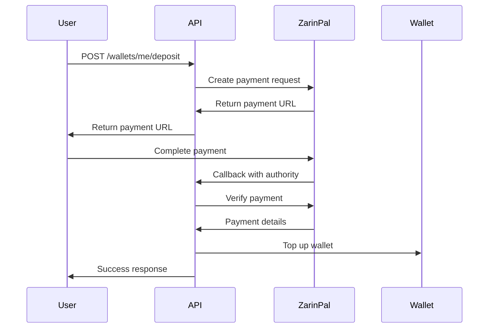
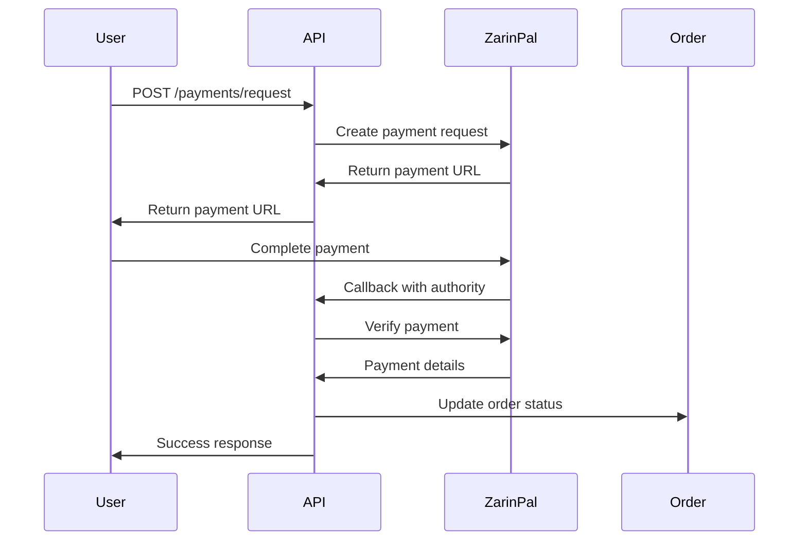

# 🏦 ZarinPal Payment Gateway Integration Guide

## 🎯 **Overview**

This guide covers the complete integration of ZarinPal payment gateway with your wallet and invoice management system. The integration provides secure payment processing for wallet deposits and order payments.

## 🔧 **Configuration**

### **Environment Variables**

Add these variables to your `.env` file:

```bash
# ZarinPal Payment Gateway Configuration
ZARINPAL_TERMINAL_ID=your_terminal_id_here
ZARINPAL_MERCHANT_KEY=your_merchant_key_here
```

### **Getting ZarinPal Credentials**

1. **Register at ZarinPal**: Visit [zarinpal.com](https://zarinpal.com) and create an account
2. **Create Terminal**: In your ZarinPal dashboard, create a new terminal
3. **Get Credentials**: Copy your Terminal ID and Merchant Key
4. **Configure Callback URLs**: Set up callback URLs for payment verification

## 🚀 **API Endpoints**

### **Wallet Deposit**

#### **1. Request Deposit**
```http
POST /api/wallets/me/deposit
Authorization: Bearer YOUR_JWT_TOKEN
Content-Type: application/json

{
  "amount": 3000000,
  "description": "شارژ کیف پول - ۳۰٬۰۰۰٬۰۰۰ تومان"
}
```

**Response:**
```json
{
  "success": true,
  "paymentUrl": "https://zarinp.al/invoice/123456789",
  "authority": "123456789",
  "invoiceId": "123456789",
  "orderId": "deposit_user123_1701436800000_3000000",
  "message": "Payment request created successfully. Redirect to payment gateway."
}
```

#### **2. Verify Deposit**
```http
POST /api/wallets/me/deposit/verify
Authorization: Bearer YOUR_JWT_TOKEN
Content-Type: application/json

{
  "authority": "123456789"
}
```

**Response:**
```json
{
  "success": true,
  "message": "Wallet deposit successful!",
  "amount": 3000000,
  "refId": "987654321",
  "newBalance": 3500000
}
```

### **Order Payment**

#### **1. Request Payment**
```http
POST /api/payments/request
Authorization: Bearer YOUR_JWT_TOKEN
Content-Type: application/json

{
  "orderId": "order_123",
  "amount": 5000000,
  "description": "Payment for order #123",
  "callbackUrl": "https://yourdomain.com/payment/callback"
}
```

#### **2. Verify Payment**
```http
POST /api/payments/verify
Authorization: Bearer YOUR_JWT_TOKEN
Content-Type: application/json

{
  "orderId": "order_123",
  "authority": "123456789"
}
```

## 📊 **Payment Flow**

### **Wallet Deposit Flow**



### **Order Payment Flow**



## 🔒 **Security Features**

### **Payment Verification**
- **Server-side verification**: All payments are verified on the server
- **RefId validation**: Prevents duplicate payments
- **Amount validation**: Ensures payment amount matches order
- **User ownership**: Verifies payment belongs to authenticated user

### **Fraud Prevention**
- **Minimum amounts**: Wallet deposits require minimum 1,000,000 Rials
- **Transaction logging**: All payment attempts are logged
- **Status tracking**: Payment status is tracked throughout the process
- **Audit trail**: Complete audit trail for all financial transactions

## 📋 **Error Handling**

### **Common Errors**

#### **1. Configuration Errors**
```json
{
  "success": false,
  "error": "Bad Request",
  "message": "ZarinPal payment gateway not configured",
  "timestamp": "2025-08-15T10:13:44.304Z"
}
```

**Solution**: Ensure `ZARINPAL_TERMINAL_ID` and `ZARINPAL_MERCHANT_KEY` are set in environment variables.

#### **2. Amount Validation**
```json
{
  "success": false,
  "error": "Bad Request",
  "message": "Minimum deposit amount is 1,000,000 Rials",
  "timestamp": "2025-08-15T10:13:44.304Z"
}
```

**Solution**: Ensure deposit amount is at least 1,000,000 Rials.

#### **3. Payment Verification Failed**
```json
{
  "success": false,
  "error": "Bad Request",
  "message": "Payment verification failed: Payment not completed",
  "timestamp": "2025-08-15T10:13:44.304Z"
}
```

**Solution**: Check if payment was actually completed on ZarinPal side.

## 🛠 **Implementation Details**

### **ZarinPal Service**

The `ZarinPalService` provides these main methods:

- `createPayment()` - Creates a new payment request
- `verifyPayment()` - Verifies payment status
- `processRefund()` - Processes refunds
- `getPaymentUrl()` - Gets payment URL for redirect
- `isConfigured()` - Checks if gateway is configured

### **Payment Service**

The `PaymentsService` handles:

- `createWalletDeposit()` - Creates wallet deposit payment
- `verifyWalletDeposit()` - Verifies wallet deposit
- `requestPayment()` - Creates order payment
- `verifyPayment()` - Verifies order payment
- `processRefund()` - Processes refunds

### **Wallet Integration**

The wallet system integrates with payments through:

- `topUpWallet()` - Credits wallet after successful payment
- `createTransaction()` - Logs payment transactions
- `getBalance()` - Returns updated balance

## 🔧 **Testing**

### **Test Payment Flow**

1. **Start the application**:
   ```bash
   npm run start:dev
   ```

2. **Test wallet deposit**:
   ```bash
   curl -X POST http://localhost:3000/api/wallets/me/deposit \
     -H "Authorization: Bearer YOUR_JWT_TOKEN" \
     -H "Content-Type: application/json" \
     -d '{"amount": 3000000, "description": "Test deposit"}'
   ```

3. **Verify payment** (after completing payment on ZarinPal):
   ```bash
   curl -X POST http://localhost:3000/api/wallets/me/deposit/verify \
     -H "Authorization: Bearer YOUR_JWT_TOKEN" \
     -H "Content-Type: application/json" \
     -d '{"authority": "PAYMENT_AUTHORITY"}'
   ```

### **Test Order Payment**

1. **Request payment**:
   ```bash
   curl -X POST http://localhost:3000/api/payments/request \
     -H "Authorization: Bearer YOUR_JWT_TOKEN" \
     -H "Content-Type: application/json" \
     -d '{"orderId": "test_order", "amount": 5000000, "description": "Test payment"}'
   ```

2. **Verify payment**:
   ```bash
   curl -X POST http://localhost:3000/api/payments/verify \
     -H "Authorization: Bearer YOUR_JWT_TOKEN" \
     -H "Content-Type: application/json" \
     -d '{"orderId": "test_order", "authority": "PAYMENT_AUTHORITY"}'
   ```

## 📊 **Monitoring**

### **Payment Logs**

All payment transactions are logged in the `payment_transactions` collection with:

- Transaction type (payment_request, payment_verification, refund, etc.)
- Amount and currency
- Payment gateway response
- User and order information
- Timestamps and status

### **Error Monitoring**

Monitor these error patterns:

- Configuration errors (missing credentials)
- Payment verification failures
- Network timeouts
- Invalid amounts or currencies

## 🚀 **Deployment**

### **Production Checklist**

- [ ] Set `ZARINPAL_TERMINAL_ID` and `ZARINPAL_MERCHANT_KEY` in production environment
- [ ] Configure callback URLs in ZarinPal dashboard
- [ ] Test payment flow with real transactions
- [ ] Monitor payment logs and error rates
- [ ] Set up alerts for payment failures

### **Environment Variables**

```bash
# Production ZarinPal Configuration
ZARINPAL_TERMINAL_ID=your_production_terminal_id
ZARINPAL_MERCHANT_KEY=your_production_merchant_key

# Frontend URL for callbacks
FRONTEND_URL=https://yourdomain.com
```

## 📚 **Related Documentation**

- [Wallet & Invoice API Documentation](./WALLET_INVOICE_API_DOCUMENTATION.md)
- [Appwrite Database Update Guide](./APPWRITE_DATABASE_UPDATE_GUIDE.md)
- [Collection Error Fix](./COLLECTION_ERROR_FIX.md)

## 🎯 **Next Steps**

1. **Configure ZarinPal credentials** in your environment
2. **Test the payment flow** with small amounts
3. **Monitor payment logs** for any issues
4. **Set up production environment** with real credentials
5. **Implement frontend integration** for payment UI

---

**Integration Status**: ✅ **COMPLETE**  
**Payment Gateway**: ZarinPal  
**Minimum Amount**: 1,000,000 Rials  
**Security**: ✅ **IMPLEMENTED**  
**Ready for Production**: ✅ **YES**
